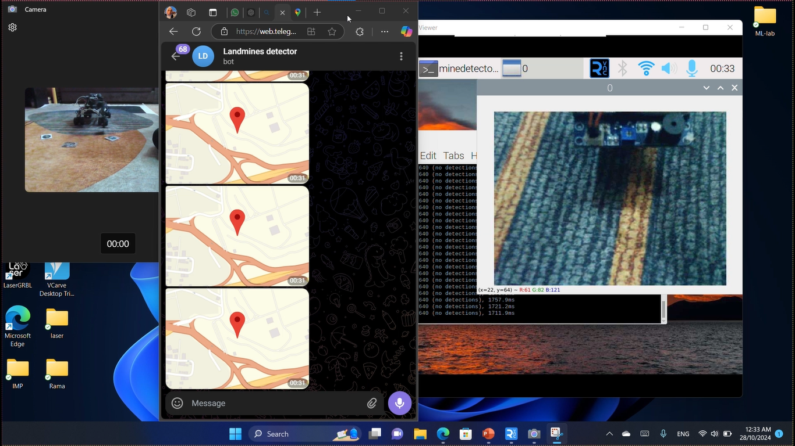
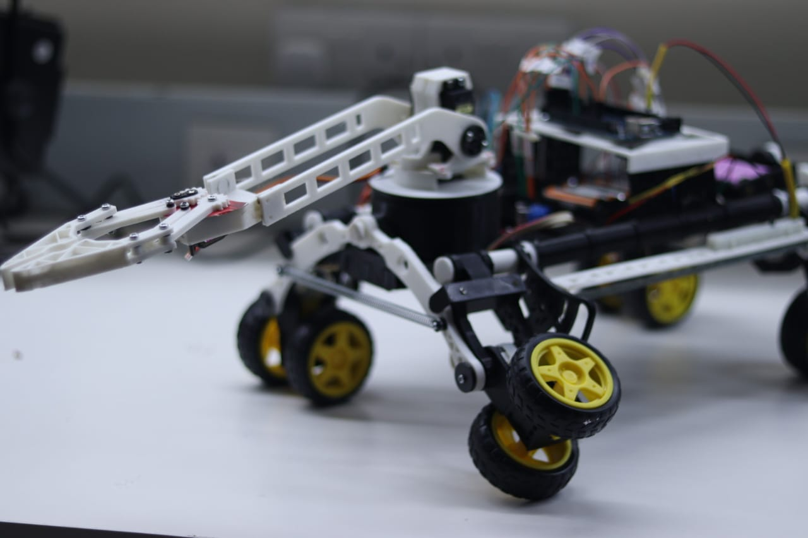

# WMR Mine Detector – D3aj Buggy

This repository contains the design, documentation, and code for **D3aj Buggy**, an embedded systems project focused on building a **mobile mine detection robot**.  
The project was developed as part of the Embedded Systems course and demonstrates integration of sensors, robotic arms, circuit controllers, and object-oriented programming.
---
### illustration video

---
### Robot Design

---
## 📂 Table of Contents
1. [Introduction](#introduction)
2. [Sensor System](#sensor-system)
3. [Robotic Arm](#robotic-arm)
4. [Circuit & Controller](#circuit--controller)
5. [Design](#design)
6. [Code](#code)
7. [References](#references)

---

## 🔎 Introduction
Mine detection is an extremely dangerous process, responsible for **over 20,000 deaths per year worldwide**.  
At the current rate, it would take nearly **1,100 years** to clear all active landmines.  
D3aj Buggy addresses this by using an **autonomous mobile robot** that can safely detect mines and reduce human risk.

---

## 📡 Sensor System
- **A88 Metal Detector Module** used as a prototype (since stronger sensors are restricted in our country).  
- Works by transmitting an electromagnetic field into the ground.  
- Any metallic object retransmits the signal, which is captured by the sensor coil.  

---

## 🤖 Robotic Arm
- Arms are crucial in mine detection robots, allowing them to inspect and interact with hazardous areas from a **safe distance**.  
- Applications: manufacturing, assembly, material handling, packaging.  
- Protects the main robot body from potential explosion damage.

---

## ⚡ Circuit & Controller
- **Wireless controller** operating at 2.4 GHz with a 10m range.  
- Powered by **2–3 AAA batteries**.  
- Includes vibration feedback and optical indicators for sending/receiving data.

---

## 🛠️ Design
- Built with **Parallel Link Suspension** (coil spring & double wishbone suspension).  
- Ensures high flexibility, balance, and adaptability to rough terrains.  
- Optimized for different environmental conditions.

---

## 💻 Code
- Implemented in **C++ (Arduino .ino)** with **Object-Oriented Programming (OOP)** principles:
  - **Encapsulation** → Wrapping data and functions into single units.  
  - Promotes modularity, reusability, and easier maintenance.

---

## 📚 References
- [Clearpath Robotics – Autonomous Demining Husky](https://clearpathrobotics.com/coimbra-autonomous-demining-husky/)  
- [IEEE Spectrum – Husky Robot for Landmine Detection](https://spectrum.ieee.org/husky-robot-takes-on-landmine-detection-while-humans-stay-very-very-far-away)  
- [GeeksforGeeks – Encapsulation in C++](https://www.geeksforgeeks.org/encapsulation-in-cpp/)  
- Siegwart, R., Nourbakhsh, I. R., & Scaramuzza, D. *Introduction to Autonomous Mobile Robots* (2nd ed.)  

---

## 👨‍💻 Authors
- Mohammad Ismail  
---

